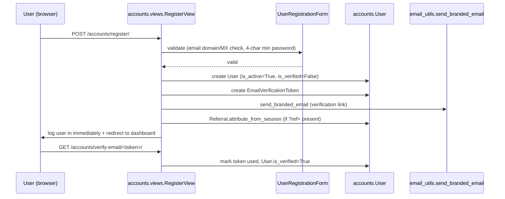
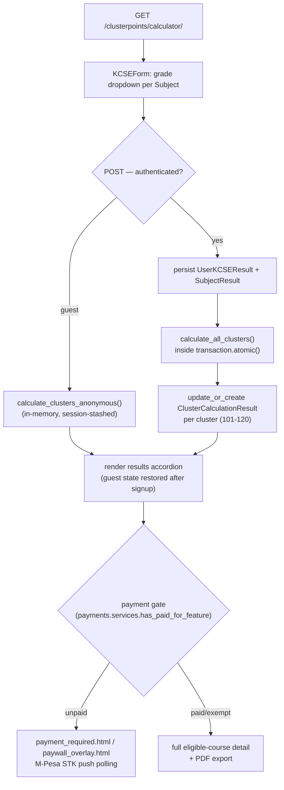
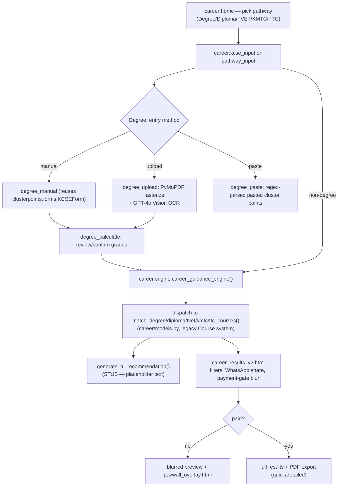
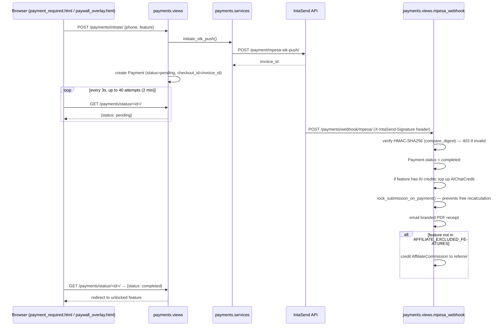
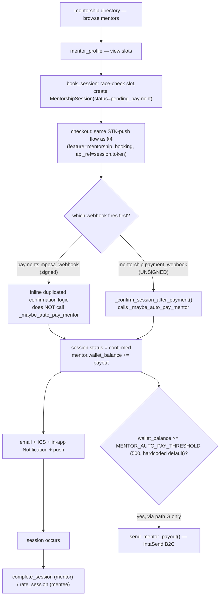
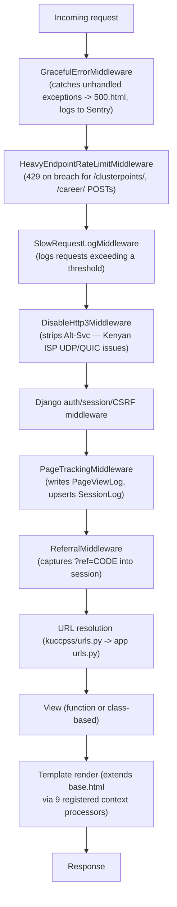
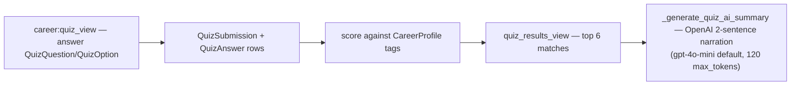

# Code Flow — Step-by-Step User Journeys

This doc traces full request/response paths through the codebase for the app's core user flows.
For the underlying route table see [URL_MAP.md](URL_MAP.md); for models touched see
[DATABASE.md](DATABASE.md); for per-file detail see [FILE_EXPLANATIONS.md](FILE_EXPLANATIONS.md).

## 1. Registration → Login → Dashboard



The user is logged in **before** email verification completes — verification only flips a flag,
it does not gate dashboard access. Google OAuth (`allauth`) skips this entirely: `accounts/signals.py`
auto-sets `is_verified=True` on social signup.

`dashboard_view` (`accounts/views.py`) then aggregates: recommended courses (from the user's latest
`ClusterCalculationResult`s), cluster-points chart data, `CourseShortlist`, `Application` timeline,
`SiteFeedback` prompt, trending courses (`courses/trends.py`, 1h cache), `CourseSpotlight`.

## 2. KCSE Cluster Points Calculator



Formula (`clusterpoints/services.py::_weighted_cp`, canonical — see [CLAUDE.md](../CLAUDE.md)):
```
cluster_points = 48 × sqrt( (core_midpoint_marks / 400) × (aggregate_total / 84) )
```
Each cluster's `subject_groups` (ordered by priority) are filled by picking the best not-yet-used
subject per slot; a required slot that can't be filled forces `weighted = 0.0`.

## 3. Career Guidance Engine — full pathway flow



Non-degree pathways match against the **legacy** `career.models.TVETCourse`/`KMTCourse`/`TTCCourse`
— a separate system from `courses.models.Course` (see [DATABASE.md](DATABASE.md) two-course-systems
note). AI chat (`career:chat`) is a parallel flow: searches `AIKnowledgeEntry` first, falls back to
an OpenAI chat completion, gated by `AIChatCredit`/`AICallLog` and `CareerConfig.ai_enabled`.

## 4. Payment (IntaSend M-Pesa STK push) — the shared gate mechanism



Manual fallback if the webhook never arrives: user pastes their M-Pesa SMS code →
`verify_by_transaction_code` matches against `Transaction.mpesa_ref`. **Note:** this fallback path
(and `verify_payment`) does **not** credit affiliate commissions — only the webhook path does (see
[IMPLEMENTATION_STATUS.md](IMPLEMENTATION_STATUS.md)).

## 5. Mentorship booking → payment → session lifecycle



The unsigned `mentorship:payment_webhook` endpoint is a **confirmed security gap** (see
[SECURITY.md](SECURITY.md) §3): a booking's UUID `token` is already visible in the checkout URL, so
anyone who observes it can POST directly to this endpoint and confirm the session — and trigger
auto-payout — without ever paying.

## 6. Affiliate/referral attribution → commission → payout

```mermaid
flowchart LR
    A["Affiliate shares link with ?ref=CODE"] --> B["ReferralMiddleware stores code in visitor session"]
    B --> C["Visitor registers"]
    C --> D["accounts.signals.on_user_signed_up\nReferral.attribute_from_session()"]
    D --> E["Referred user makes ANY paid-feature payment\n(except mentorship_booking, ai_chat_access)"]
    E --> F["payments.views.mpesa_webhook computes\ncommission = rate% x payment.amount"]
    F --> G["AffiliateCommission created (idempotent)\naffiliate.wallet_balance += commission"]
    G --> H["accounts:affiliate_dashboard — view stats"]
    H --> I["request_affiliate_payout (@require_recent_auth)\nbounded by SiteSetting['affiliate_min_withdrawal']"]
    I --> J["payments.services.send_affiliate_payout()\nIntaSend B2C"]
```



## 7. Full request lifecycle (every request)



See [DJANGO_ARCHITECTURE.md](DJANGO_ARCHITECTURE.md) for the exact `MIDDLEWARE` ordering and each
class's implementation detail.

## 8. Career quiz flow



## Cross-references

- The dual `get_client_ip()` implementations (§7's `PageTrackingMiddleware` uses first-XFF-entry,
  the rate limiter uses last-XFF-entry) mean the same request can be "seen" as two different client
  IPs by different parts of the stack — see [SECURITY.md](SECURITY.md) §9.
- Every AI call site (§3, §8) wraps the OpenAI call in a broad try/except that degrades to
  templated/KB-only text on failure — no raw API error ever reaches the user. See
  [API_AND_SERVICES.md](API_AND_SERVICES.md).
