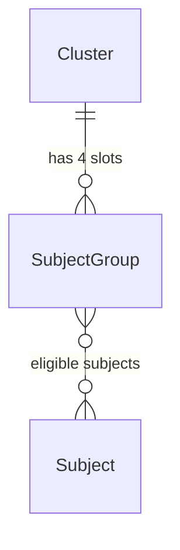
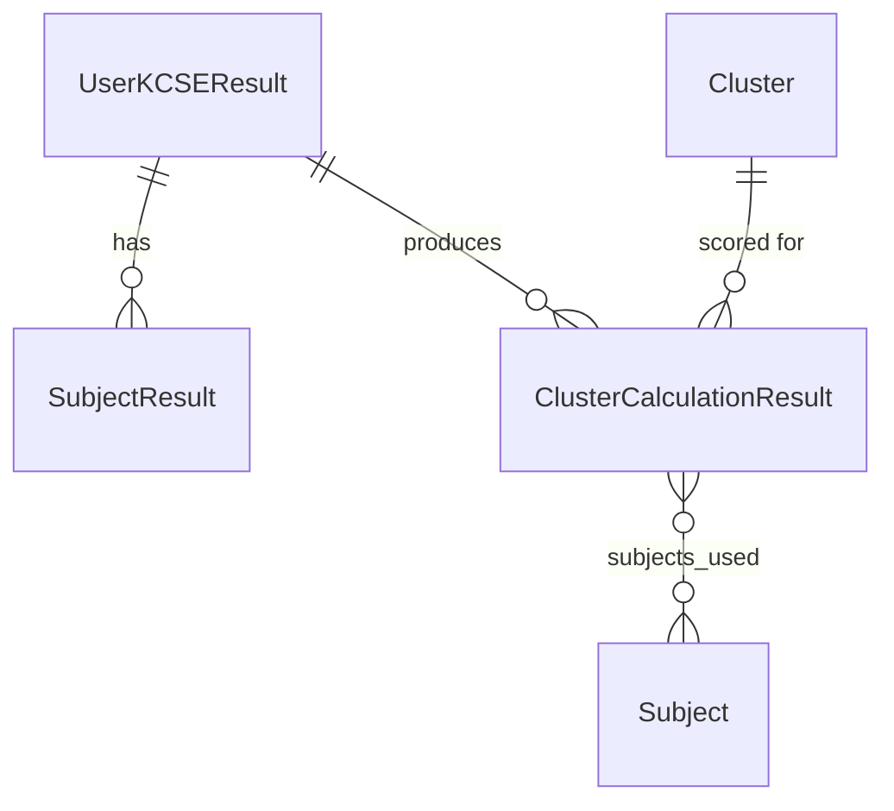
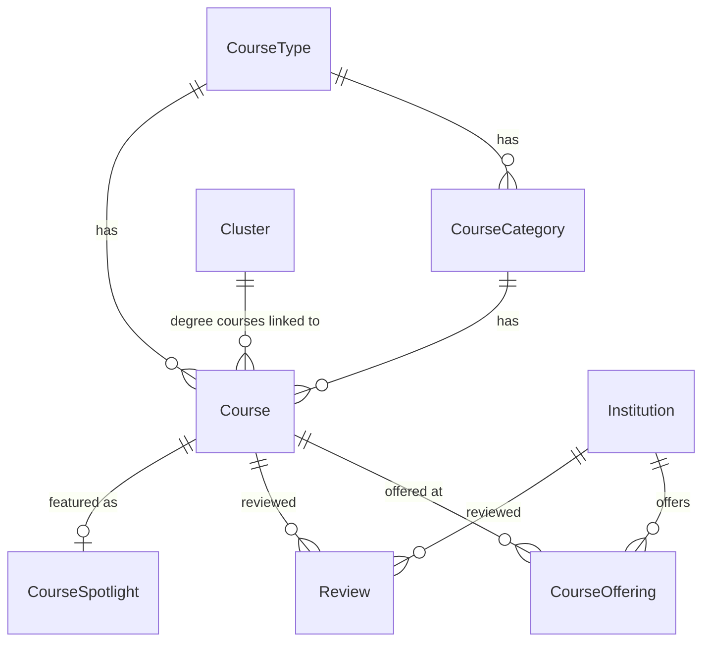
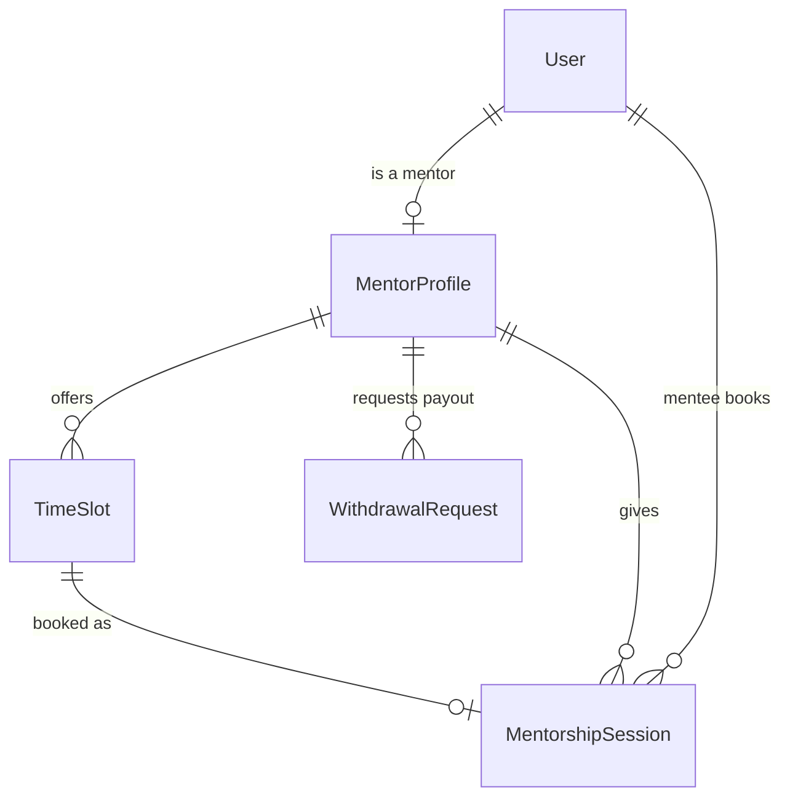
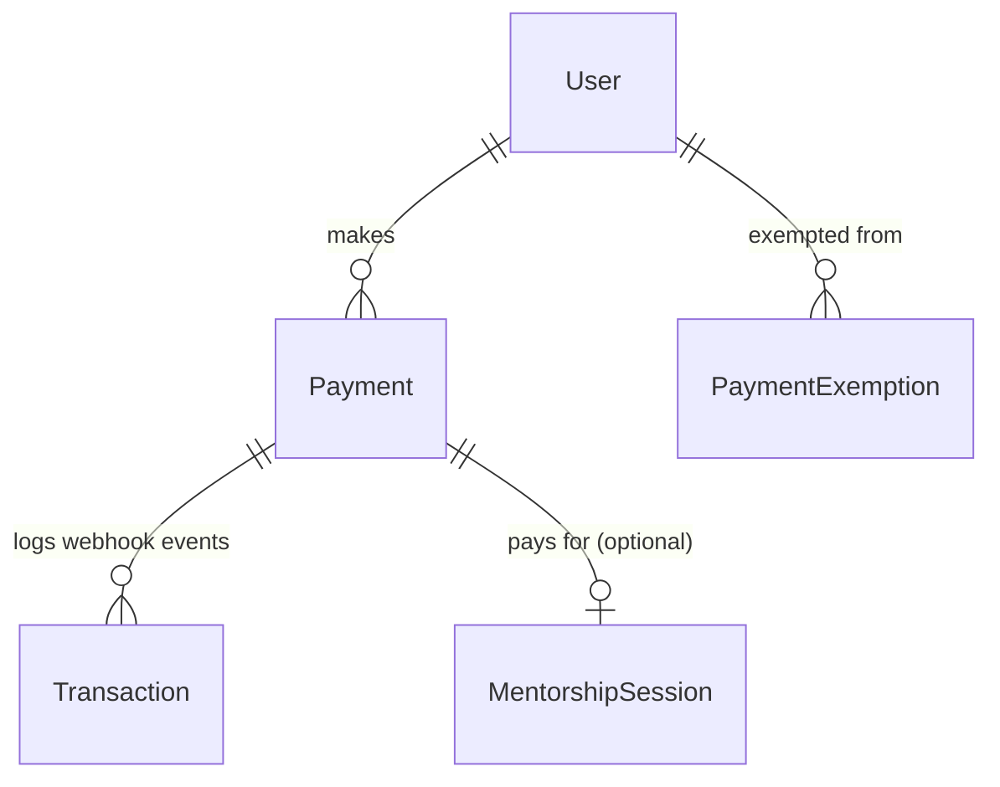
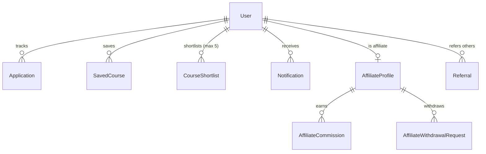
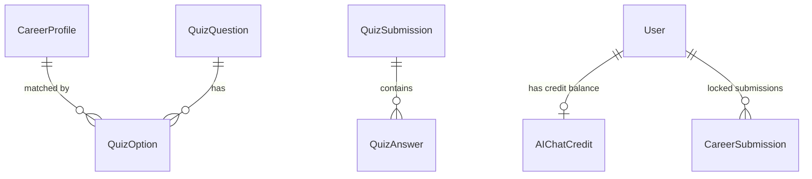
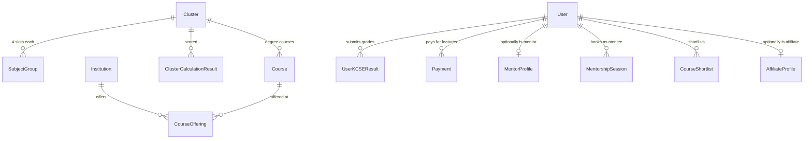

# Database Schema

All models use `settings.AUTH_USER_MODEL` (`accounts.User`, UUID primary key) for user
relationships — never Django's default `auth.User` (see [CLAUDE.md](../CLAUDE.md) rule #3).
Postgres is used in production (`dj_database_url` from `DATABASE_URL`), SQLite (`db.sqlite3`) in
local dev.

## clusters app

### `Subject` ([clusters/models.py](../clusters/models.py))
| Field | Type | Notes |
|---|---|---|
| name | CharField(100), unique | e.g. "Mathematics" |
| code | CharField(20), blank/null | optional future KNEC code |
| group | CharField(4), choices I–V, blank | KCSE subject group |

### `Cluster`
| Field | Type | Notes |
|---|---|---|
| name | CharField, unique | e.g. "Medicine (13A)" or "Law" |
| slug | SlugField, unique | auto-generated |
| description | TextField, blank | |
| color_code / icon / image | display metadata | |
| number | PositiveIntegerField, unique | 101–120 = the 20 master calculation clusters; <100 = ~61 programme sub-clusters (1A–20F) |

`kuccps_number` property: for numbers 101–120 returns `number-100`; else parses trailing
`(\d+)[A-Za-z]*` from the name. `save()` auto-slugs and auto-assigns `number`.

### `SubjectGroup`
| Field | Type | Notes |
|---|---|---|
| cluster | FK → Cluster (CASCADE), related_name `subject_groups` | |
| name | CharField | slot label, e.g. "Group II Best" |
| subjects | M2M → Subject, related_name `subject_groups` | eligible subjects for this slot |
| required | BooleanField, default True | |
| priority | PositiveIntegerField, default 1 | lower = filled first |

Each master cluster (101–120) has **exactly 4 `SubjectGroup` slots** (seeded by
`clusters/management/commands/seed_clusters.py`) — this is the data structure the cluster-points
algorithm iterates over.

## clusterpoints app

### `GradePoint` ([clusterpoints/models.py](../clusterpoints/models.py))
`grade` (unique) → `points` (1–12). Fallback source is `DEFAULT_GRADE_CHOICES` in `forms.py` if
this table is empty.

### `UserKCSEResult`
| Field | Type | Notes |
|---|---|---|
| user | FK → AUTH_USER_MODEL, null/blank | null for anonymous/guest snapshots (rare) |
| mean_grade | CharField | |
| total_points | PositiveIntegerField, editable=False | KCSE aggregate (max 84), via `recalc_total_points()` |

### `SubjectResult`
`kcse_result` FK → UserKCSEResult (CASCADE, related_name `subject_results`), `subject` FK →
`clusters.Subject`, `points` (1–12, validated in `clean()`). `unique_together=(kcse_result, subject)`.

### `ClusterCalculationResult`
| Field | Type | Notes |
|---|---|---|
| user | FK → AUTH_USER_MODEL, null/blank | |
| kcse_result | FK → UserKCSEResult, related_name `cluster_results` | |
| cluster | FK → clusters.Cluster, related_name `calculation_results` | |
| cluster_points / weighted_calculation | FloatField, editable=False | the computed 0–48 score |
| core_subject_total / aggregate_total | PositiveIntegerField, editable=False | |
| subjects_used | M2M → clusters.Subject | which 4 subjects were selected |

`unique_together=(user, kcse_result, cluster)`. **Formula discrepancy** (flagged per CLAUDE.md
instructions to state incompleteness rather than guess): this model's own
`calculate_cluster_points()` method implements the **old, non-canonical** fraction-based formula
(`48*sqrt((raw_core_total/48)*(aggregate_total/84))`), which CLAUDE.md explicitly forbids
reverting to. The **live**, canonical formula (midpoint-marks based) lives in
[clusterpoints/services.py](../clusterpoints/services.py)`::_weighted_cp()`, and it is that
function — not the model method — that `clusterpoints/views.py::kcse_calculator_view` actually
calls via `calculate_all_clusters()`/`calculate_clusters_anonymous()`. The model method therefore
appears to be **dead code**, but its presence is a latent risk if anything is ever refactored to
call it directly.

## courses app (the newer, unified course system)

### `CourseType` / `CourseCategory` ([courses/models.py](../courses/models.py))
`CourseType`: name/slug (unique), description, icon, color_code (Degree, Diploma, KMTC, TTC,
various "TVET ..." levels, Short Courses, Artisan Certificate). `CourseCategory`: name/slug,
FK → CourseType (CASCADE, related_name `categories`), `unique_together=(name, course_type)`.

### `Course`
| Field | Type | Notes |
|---|---|---|
| name | CharField(200) | |
| slug | SlugField, unique | auto, collision-safe suffixing |
| course_type | FK → CourseType (CASCADE) | |
| category | FK → CourseCategory (SET_NULL, null) | |
| institutions | M2M → institutions.Institution, through=`CourseOffering` | |
| cluster | FK → clusters.Cluster (SET_NULL, null) | **only set for university/degree courses** |
| core_subjects | M2M → clusters.Subject | |
| cutoff_points | JSONField, blank/null | legacy/summary field — superseded by `CourseOffering.cutoff_points`; not read by live eligibility/predictor/trends code |
| minimum_mean_grade | CharField(5), blank | used **only** by non-degree eligibility |
| subject_requirements | JSONField, blank/null | list of `{slot, subjects_str, min_grade}` — degree pathway only |
| duration, career_outcomes, pdf_file | metadata | |

`is_university_course()` → `self.cluster is not None`. Note: **two separate course systems** exist
— this `courses.Course` (linked to institutions/clusters) vs. `career.Course` (legacy, linked to
`career.University`/`career.CourseCategory`) — see [CLAUDE.md](../CLAUDE.md) rule #5 and the
cross-app note below.

### `CourseOffering` (through-model, the authoritative per-institution cutoff record)
`course` FK (CASCADE, related_name `offerings`), `institution` FK (CASCADE, related_name
`offerings`), `programme_code` (KUCCPS code), `cutoff_points` JSONField (e.g.
`{"2024": 78.5, "2023": 74.0}`). `unique_together=(course, institution)`. `latest_cutoff()`
returns the most recent year's value.

### `Review`
`course` FK (null) OR `institution` FK (null) — exactly one is set; `rating` (1-5), `body`
(≤280 chars), `user` FK → AUTH_USER_MODEL. Conditional unique constraints: one review per
user per course, one per user per institution.

### `CourseSpotlight`
Editorial "Course of the Week": `course` FK, `headline`, `summary`, `hero_image`, `start_date`,
`end_date`. `current()` classmethod returns the live spotlight or `None`.

## institutions app

### `InstitutionType` ([institutions/models.py](../institutions/models.py))
name/slug (unique), description, icon, color_code. (Public University, Private University,
KMTC, Public/Private TVET, TTC, Specialized Schools.)

### `Institution`
name, abbreviation, slug (unique, auto), `institution_type` FK (CASCADE, related_name
`institutions`), description, location, website, email, phone, logo, pdf_file. No direct FK to
Course — the relationship is owned by `courses.Course.institutions` (M2M through
`CourseOffering`).

### `InstitutionPromotion`
Paid marketing record: `tier` (featured / scholarship / course_spotlight), `pathway` (all /
Degree / Diploma / KMTC / TVET / TTC), `institution` FK, `featured_course` FK →
`courses.Course` (SET_NULL, course_spotlight tier only), scholarship fields
(title/description/amount/deadline/link), campaign window (`start_date`/`end_date`), internal
contact/notes. `is_live`, `days_remaining`, `scholarship_deadline_soon` properties.

## predictor app

### `PredictionConfig` (singleton, pk=1) ([predictor/models.py](../predictor/models.py))
`rising_floor_multiplier` (0.50), `rising_floor_cap` (3.0), `stable_floor_offset` (0.0),
`band_multiplier` (1.0) — tunable knobs for the WMA+naive cutoff-prediction algorithm (see
[predictor/services.py](../predictor/services.py) and [FEATURES.md](FEATURES.md)). No
relationships — standalone config table.

## mentorship app

### `MentorProfile` ([mentorship/models.py](../mentorship/models.py))
`user` O2O → AUTH_USER_MODEL (related_name `mentor_profile`), `course` FK → courses.Course
(SET_NULL, related_name `mentors`), `institution` FK → institutions.Institution (SET_NULL,
related_name `mentors`), `year_of_study`, `bio`, `whatsapp`, `photo`,
`student_id_upload`/`portal_screenshot` (verification docs), `university_email`,
`custom_session_price`/`custom_mentor_payout` (per-mentor overrides), `wallet_balance`,
`total_earned`, `total_sessions`, `average_rating`, `is_approved`/`is_active`/`is_rejected`
(permanent block), `rejection_reason`.

### `TimeSlot`
`mentor` FK (related_name `slots`), `date`, `start_time`, `is_booked`.
`unique_together=(mentor, date, start_time)`.

### `MentorshipSession`
`token` (UUID4, unique — the public session identifier), `mentor` FK (related_name `sessions`),
`mentee` FK → AUTH_USER_MODEL (related_name `mentorship_sessions`), `slot` O2O (related_name
`session`), `course_interest` FK → courses.Course (SET_NULL), `mentee_question`,
`mentee_phone`, `amount` (default 100), `mentor_payout` (default 70), `payment_ref`
(IntaSend invoice id), `manual_payment_ref`, `confirmation_sent`, `status` (pending_payment /
pending_manual_verification / confirmed / completed / cancelled / refunded), `meet_link`
(**dead column — never written or read anywhere in the codebase**), `rating`, `review`.

### `WithdrawalRequest`
`mentor` FK (related_name `withdrawals`), `amount`, `mpesa_number`, `status` (pending / processed
/ rejected — **note:** code sometimes writes `"failed"`, which is not in this choice list, a
latent data-integrity inconsistency), `admin_note`, `processed_at`.

### `MentorshipConfig` (singleton, pk=1)
`session_price` (100), `mentor_payout` (70), `mentor_signup_enabled` (site-wide toggle).

## payments app

### `PaymentFeature` ([payments/models.py](../payments/models.py))
`feature` (unique), `label`, `price` (KES, 0=free), `is_enabled`.

### `Payment`
`user` FK, `feature` (choice: view_cluster_points / view_eligible_courses /
premium_career_report / advanced_analysis / ai_chat_access / mentorship_booking), `amount`,
`phone_number`, `checkout_id` (unique only when non-empty), `status` (pending / completed /
failed / refunded), `mpesa_code` (manual verification), `mentorship_session` O2O → SET_NULL.
`product` property maps feature → one of 4 user-facing products via `FEATURE_TO_PRODUCT`.

### `PaymentExemption`
`user` FK, `feature` (blank = ALL features), `note`, `granted_by` FK → AUTH_USER_MODEL
(SET_NULL). `unique_together=(user, feature)`. Staff (`is_staff=True`) are always exempt without
needing a row (enforced in code, not at model level).

### `Transaction`
`payment` FK (CASCADE, related_name `transactions`), `mpesa_ref`, `phone_number`, `amount`,
`raw_response` (JSONField — raw IntaSend webhook payload).

## accounts app

### `User` (custom, AUTH_USER_MODEL) ([accounts/models.py](../accounts/models.py))
UUID pk, `email` (unique, `USERNAME_FIELD`, no username field at all), `full_name`, `is_active`,
`is_staff`, `is_verified`, `is_suspended`, `is_google_user`, `agreed_terms`/`terms_version`,
`last_login_ip`/`last_login_user_agent`, `phone_number`, `county`, `kcse_year`,
`profile_picture`, `email_notifications`, `deleted_at` (soft delete).

### Auth/session support models
`EmailVerificationToken`, `PasswordResetToken`, `RememberToken` (all FK → User, unique token,
expiry + `is_valid()`), `DeviceSession` (session_key, ip, device_name, last_activity),
`LoginHistory` (ip, user_agent, success, login_time/logout_time).

### Student-facing models
- `Application` — KUCCPS application tracker (course_name, institution_name, status: draft /
  submitted / under_review / waitlisted / accepted / rejected, deadline, notes).
- `SavedCourse` (FK → courses.Course), `SavedCareer` (FK → career.CareerProfile) — bookmarking.
- `CourseShortlist` — FK → courses.Course, `rank` (1-4, KUCCPS choice order), `notes`. Capped at
  5 per user (enforced in `shortlist_toggle` view, not a DB constraint).
- `Notification` — message/notif_type/is_read/link, optional `published_by` (staff).
- `CareerSessionSnapshot` — cached career-engine run results for the dashboard.

### Affiliate & referral models
- `Referral` — referrer FK (related_name `referrals_sent`), `code` (unique), `referred_user` O2O
  (SET_NULL), `converted`, `converted_at`.
- `AffiliateProfile` — `user` O2O, `is_active`, `commission_rate` (default 20.00%),
  `wallet_balance`, `total_earned`, `approved_by`/`approved_at`.
- `AffiliateCommission` — `affiliate` FK, `payment` O2O → payments.Payment, `referred_user` FK
  (SET_NULL), `referral` FK (SET_NULL), `amount`, `rate_snapshot`, `status` (pending/paid_out).
- `AffiliateWithdrawalRequest` — `affiliate` FK, `amount`, `mpesa_number`, `status` (pending /
  processed / failed), `admin_note`.

### Marketing/growth models
`EmailLead` (pre-registration email capture), `PushSubscription` (Web Push endpoint/keys),
`EmailBroadcast` (bulk email campaigns).

## career app (the legacy course system + AI/quiz infrastructure)

### Legacy course models ([career/models.py](../career/models.py))
`CourseCategory` (legacy, distinct from `courses.CourseCategory`), `University` (legacy, distinct
from `institutions.Institution`), `Course` (legacy — FK to `University`/`CourseCategory`/
`clusters.Cluster`, nullable cluster bridged from `courses.Course` by the
`sync_career_clusters` management command), `CourseCutoff`/`CourseCutoffHistory`,
`TVETCategory`/`TVETCourse`, `KMTCampus`/`KMTCourse`, `TTCCollege`/`TTCCourse`,
`StudentCourseMatch` (a computed match result per user/session), `AIRecommendation` (stored GPT
output).

### Career guidance / quiz models
`CareerProfile` (title, slug, icon, demand_level, average_salary, career_tags, description,
duties, skills_required, educational_pathway, job_opportunities, future_outlook),
`CareerInsight`, `QuizQuestion`/`QuizOption`/`QuizSubmission`/`QuizAnswer`.

### AI infrastructure models
- `CareerConfig` (singleton, pk=1) — `ai_enabled`, `ai_model_name` (default `gpt-4o-mini`),
  `ai_temperature`, free/paid AI credit limits.
- `AIKnowledgeEntry` — category/question/answer/keywords/order (KB searched before GPT fallback).
- `JobMarketData` — career_name/keywords/salary_min/salary_max/demand/top_sectors.
- `AICallLog` — anonymous/session AI call rate-limiting (session key or IP + date + count).
- `AIChatCredit` — per-user free-lifetime + paid AI chat message balance.
- `SharedResult` — `token` (UUID), JSON snapshot, `expires_at` — shareable public result links.
- `SubmissionLockConfig` (singleton) / `CareerSubmission` — shared submission-lock mechanism
  (also used by `clusterpoints`) preventing recalculation abuse after a payment/grace period.

## resources app

`SiteSetting` (generic key/value config store — the universal admin-tunable settings mechanism
used across mentorship/payments/courses pagination/etc. via `SiteSetting.get(key, default)`),
`FAQItem`, `SuccessStory`, `ResourceCategory`/`Resource` (downloadable PDFs/videos/links),
`Article` (blog content, tags, featured flag), `Announcement` (site banner), `DeadlineBanner`
(KUCCPS countdown, admin-restricted to one row), `SiteFeedback` (bug/suggestion reports).

## analytics app

All models FK to AUTH_USER_MODEL (`related_name='+'`, no reverse accessor) + `session_key` +
indexed `created_at`: `PageViewLog` (every request, written by `PageTrackingMiddleware`),
`UserActionLog` (login/shortlist/quiz/etc.), `SessionLog` (one row per browser session,
`duration_seconds` property), `SearchLog`, `ViewLog` (generic content view), `DownloadLog`,
`EventLog` (generic catch-all), `PWAInstallLog`, `CareerEngineLog`.

## Cross-app relationship summary

**Two separate, unmerged course systems** (per [CLAUDE.md](../CLAUDE.md) rule #5): `career.Course`
/`TVETCourse`/`KMTCourse`/`TTCCourse` (legacy, engine-facing) vs. `courses.Course` (newer, unified,
linked to `institutions`/`clusters`, used by the public directory and eligible-courses pages).
`career/management/commands/sync_career_clusters.py` is a one-way bridging script copying
`cluster` FK from `courses.Course` → `career.Course` by name match — direct evidence of the split
and an in-progress (manual, not automatic) reconciliation effort.
